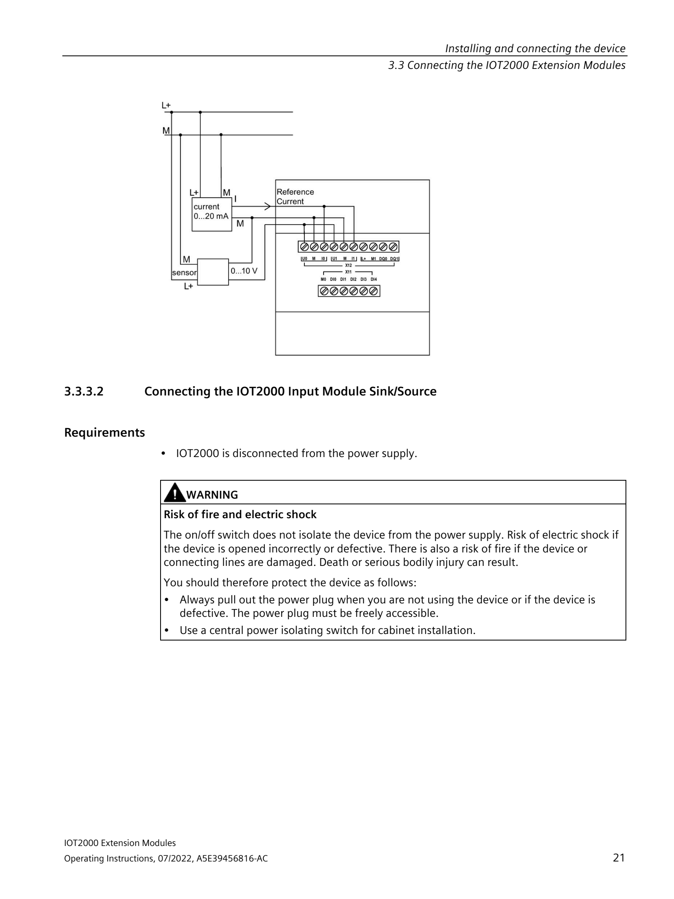
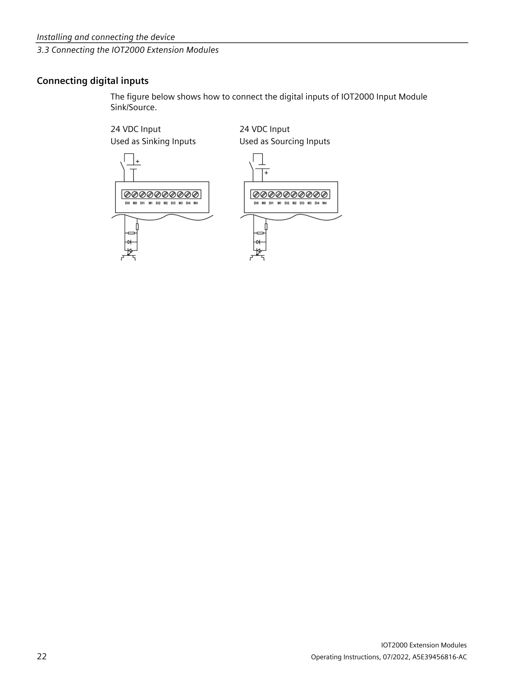

# Práctica 1: Control de salidas digitales DQ con el Siemens IOT2050

**Módulo:** SIMATIC IOT2050 Basic PG2 + Shield IO 6ES7647-0KA01-0AA2
**Duración:** 2 horas
**Objetivo:** Aprender a identificar, cablear y controlar las salidas digitales DQ del shield IO.

---

## 📖 Manual oficial Siemens

Descarga el manual completo aquí:
- **Siemens Support:** https://support.industry.siemens.com/cs/document/109745681/iot2000-extension-modules-operating-instructions
- **Documento:** `A5E39456816-AB_Operating_Instructions_IOT2000_Extension_Modules_1910.pdf`

---

## 📦 Modelos del shield

| Modelo | Descripción |
|--------|------------|
| **6ES7647-0KA01-0AA2** ⬅️ El nuestro | **Input/Output Module** — 5x DI, 2x AI, **2x DQ** (con salidas) |
| 6ES7647-0KA02-0AA2 | Input Module Sink/Source — 8x DI (solo entradas) |

> El **0KA01** es el modelo completo con **salidas digitales (DQ)**. El **0KA02** solo tiene entradas.

---

## 🎯 Objetivos de la práctica

- Identificar los conectores y bornes del shield IO
- Cablear correctamente las salidas DQ con alimentación externa
- Acceder al IoT2050 vía SSH (PuTTY)
- Descubrir los GPIOs de las salidas con `gpioinfo`
- Configurar el PCAL9535 (control de dirección hardware)
- Activar/desactivar las DQ desde terminal
- Controlar las DQ desde el dashboard de Node-RED

---

# 🔧 PARTE 1 — HARDWARE

## 🔍 1.1 Estructura física del módulo

**Sección 1.2.1 del manual (Pág. 7):**


*Pág 7 del manual: estructura del módulo con descripción de cada conector*

### Leyenda del módulo 6ES7647-0KA01-0AA2:

| Núm. | Conector | Descripción |
|------|----------|-------------|
| ① | **Analog interface M** | Masa de las entradas analógicas → X12-2, X12-5 |
| | **U0, U1** | Entradas de tensión analógica (0-10V) → **X12-1, X12-4** |
| | **I0, I1** | Entradas de corriente analógica (0-20mA) → **X12-3, X12-6** |
| ② | **Digital output interface M (M1)** | Masa de las salidas digitales → X12-8 |
| | **DO0, DO1** | Salidas digitales (24V, 0.3A) → **X12-9 (DQ0), X12-10 (DQ1)** |
| ③ | **Digital input interface** | Entradas digitales → **X11-2 a X11-6 (DI0-DI4)** |
| | **M (M0)** | Masa de las entradas digitales → X11-1 |
| ④ | **X1** | Conector de bornes principal (13 pines) |
| ⑤ | **X2** | Alimentación externa para las salidas DQ |
| ⑥ | **X3** | Conector Arduino (acoplamiento al IoT2050) |

---

## 🔌 1.2 Pinout del conector X1 (bornes)

### Tabla resumen de conexiones:

| Conector | Borne | Señal | Función |
|----------|-------|-------|---------|
| **X11** (inferior) | 1 | **M0** | Masa de las entradas digitales |
| | 2 | **DI0** | Entrada digital 0 |
| | 3 | **DI1** | Entrada digital 1 |
| | 4 | **DI2** | Entrada digital 2 |
| | 5 | **DI3** | Entrada digital 3 |
| | 6 | **DI4** | Entrada digital 4 |
| **X12** (superior) | 1 | **U0** | Entrada analógica 0 - tensión (+) |
| | 2 | **M** | Masa analógica 0 |
| | 3 | **I0** | Entrada analógica 0 - corriente (+) |
| | 4 | **U1** | Entrada analógica 1 - tensión (+) |
| | 5 | **M** | Masa analógica 1 |
| | 6 | **I1** | Entrada analógica 1 - corriente (+) |
| | **7** | **L+** | **Alimentación +24V DC del módulo** |
| | **8** | **M1** | **Masa para las salidas DQ** |
| | **9** | **DQ= (DQ0)** | **Salida digital 0 — 24V, 0.3A, PNP** |
| | **10** | **DQ1** | **Salida digital 1 — 24V, 0.3A, PNP** |

> ⚠️ **Nota:** El shield 6ES7647-0KA01-0AA2 tiene **dos conectores** X11 (inferior, 6 pines) y X12 (superior, 10 pines). Esto corresponde a las etiquetas impresas en el módulo. Las salidas DQ son **PNP (current-sourcing)** — proporcionan +24V. Carga entre DQ y M1 (X12-8).

## ⚡ 1.3 Cableado de las salidas DQ

> 🔧 Importante: Según el datasheet (Pág. 26 del manual), las DQ son **"current-sourcing" (PNP)**. Esto significa que **proporcionan +24V** en los bornes X12-9 (DQ0) y X12-10 (DQ1) cuando se activan. Por lo tanto, la carga se conecta **entre DQ y M1 (X12-8)**.

**⚠️ REQUISITO INDISPENSABLE:** Las salidas DQ necesitan **alimentación externa de 24V DC** en el conector X12: **L+ (borne 7)** y **M1 (borne 8)**. Sin esto, no funcionan aunque el software las active.

### 1.3.1 Alimentación de las salidas DQ (Pág. 20 del manual)


*Pág 20: conexión de la fuente de alimentación externa para DQ0 y DQ1 (bornes 7 (L+) y 8 (Masa))*

### 1.3.2 Conexión de las entradas digitales DI (Pág. 21 del manual)



*Pág 21: conexión de los sensores / interruptores a las entradas DI0-DI4 (conector X11)*

### 1.3.3 Conexión de las salidas digitales DQ (Pág. 22 del manual)



*Pág 22: conexión de cargas a DQ0/DQ1 y sensores analógicos a AI0/AI1*

### 1.3.4 Esquema resumen de cableado

```
               ┌───────────────────────────────────┐
               │         IoT2050 + Shield           │
               │                                   │
  [X12-7]  ───┤ L+ (+24V)    (alimentación mód.)  │
  [X12-8]  ───┤ M1 (GND DQ)  (masa salidas)       │
               │                                   │
  [X12-9]  ───┤ DQ0 ──── Carga ────┐             │
               │                    │              │
  [X12-10] ───┤ DQ1 ──── Carga ────┤             │
               │                    │              │
  [X12-8]  ───┤ M1 ─────────────────┘             │
               │                                   │
  [X11-2]  ───┤ DI0 ──── Sensor/Pulsador          │
  [X11-3]  ───┤ DI1 ──── Sensor/Pulsador          │
               └───────────────────────────────────┘
```

### 1.3.5 Ejemplo práctico con LED

```
X12-7 (L+) ──── Fuente 24V (+)
X12-8 (M1) ──── Fuente 24V (-)

X12-9 (DQ0) ──── LED 🔴 ──── R 1kΩ ──── X12-8 (M1)
```

**Funcionamiento:**
- Cuando se activa DQ0 → X12-9 se pone a +24V → el LED se enciende
- Cuando se desactiva DQ0 → X12-9 se pone a 0V → el LED se apaga

### 1.3.6 Prueba con multímetro (sin carga)

Modo **V⎓ DC**:

| Medir entre | DQ = ON | DQ = OFF |
|-------------|---------|----------|
| **X12-10 (DQ1)** y **X12-8 (M1)** | ~24V ✅ | ~0V ❌ |

> 💡 El multímetro mide la tensión que **sale** de DQ1 respecto a M1 (X12-8).

---

# 💻 PARTE 2 — SOFTWARE

## 🔌 2.1 Acceso al IoT2050 vía PuTTY

1. Abre **PuTTY**
2. Configura:
   - **Host Name:** `192.168.200.1`
   - **Port:** `22`
   - **Connection type:** `SSH`
3. Haz clic en **Open**
4. Usuario: `root`
5. Contraseña: `123456`

> ✅ ¡Ya estás dentro del IoT2050!

### Comandos básicos para explorar el sistema

```bash
# Información del sistema
uname -a

# ¿Qué modelo de IoT2050 es?
cat /proc/device-tree/model

# ¿Qué gpiochips hay?
gpiodetect
```

---

## 🔍 2.2 Descubrir los GPIOs de las salidas DQ

Las salidas DQ0 y DQ1 están conectadas a los GPIOs del procesador del IoT2050. Para saber qué números de GPIO tienen, hay que explorar el sistema.

### Paso 1: Identificar los gpiochips

```bash
gpiodetect
```

En nuestro IoT2050 hay **6 gpiochips**. Los que nos interesan son los que tienen las señales **IO0-IO13**:

| Chip | GPIOs | Dispositivo | Función |
|------|-------|-------------|---------|
| **gpiochip3** | **408-463** | **42110000.gpio** | **GPIOs del procesador** |
| **gpiochip4** | **312-407** | **600000.gpio** | **GPIOs del procesador** |
| gpiochip1 | 480-495 | PCAL9535 (I2C) | Dirección IO0-IO13 |
| gpiochip0 | 496-511 | PCAL9535 (I2C) | Pull-ups |

### Paso 2: Listar las líneas de cada chip

```bash
gpioinfo gpiochip3
gpioinfo gpiochip4
```

En **gpiochip3** (base 408, 56 líneas) encontramos las **entradas digitales**:
```
line 29: "IO0" → gpio408+29 = gpio437 → DI0 (Borne 1)
line 30: "IO1" → gpio408+30 = gpio438 → DI1 (Borne 2)
line 31: "IO2" → gpio408+31 = gpio439 → DI2 (Borne 3)
line 33: "IO3" → gpio408+33 = gpio441 → DI3 (Borne 4)
```

En **gpiochip4** (base 312, 96 líneas) encontramos más entradas y las **salidas**:
```
line 33: "IO4" → gpio312+33 = gpio345 → DI4 (Borne 5)
line 43: "IO7" → gpio312+43 = gpio355 → DQ1 (X12-10) ✅
line 48: "IO8" → gpio312+48 = gpio360 → DQ0 (X12-9) ✅
```

### Paso 3: Fórmula para calcular el número de GPIO

```
Número GPIO = BASE_DEL_CHIP + NÚMERO_DE_LÍNEA

Ejemplo para DQ1: gpiochip4 (base 312) + line 43 (IO7) = gpio355
Ejemplo para DQ0: gpiochip4 (base 312) + line 48 (IO8) = gpio360
```

### Paso 4: Confirmación experimental

Una vez los GPIOs estén exportados y configurados (sección 2.3), probad:

```bash
# DQ1 (X12-10)
echo 1 > /sys/class/gpio/gpio355/value   # DQ1 ON 🟢
echo 0 > /sys/class/gpio/gpio355/value   # DQ1 OFF ⚫

# DQ0 (X12-9)
echo 1 > /sys/class/gpio/gpio360/value   # DQ0 ON 🟢
echo 0 > /sys/class/gpio/gpio360/value   # DQ0 OFF ⚫
```

Verificar el estado:
```bash
cat /sys/class/gpio/gpio355/value   # DQ1: 0 o 1
cat /sys/class/gpio/gpio360/value   # DQ0: 0 o 1
```

> 📝 Los números de GPIO (355 = DQ1, 360 = DQ0) dependen de cómo el kernel de Linux asigna los controladores al arrancar. En otro IoT2050 podrían ser diferentes, por eso es importante saber cómo descubrirlo con `gpioinfo`.

---

### ⚠️ 2.2.1 Arquitectura del shield: PCAL9535 (¡el paso oculto!)

El shield 6ES7647-0KA01-0AA2 utiliza **tres PCAL9535** (GPIO expanders por I2C) para gestionar las E/S. Estos chips **controlan la dirección** de las señales IO0-IO13 a nivel hardware:

| I2C Addr | gpiochip | Función |
|----------|----------|---------|
| **0x21** | **gpiochip1 (GPIOs 480-495)** | **Direction control para IO0-IO13** |
| 0x25 | gpiochip2 (GPIOs 464-479) | Pull-up/down resistors |
| 0x20 | gpiochip0 (GPIOs 496-511) | Enables y pull de las entradas analógicas |

**¿Por qué las DQ no funcionan al principio?**

Porque **gpiochip1** inicializa todas las direcciones a **input (lo)**. Para poder escribir en DQ0/DQ1 hay que poner el pin de dirección correspondiente a **output (hi)**:

| Señal | IO | GPIO direction | Necesario para DQ |
|-------|-----|---------------|-------------------|
| **DQ1** (X12-10) | IO7 | **gpio487** (IO7-direction) | **hi** = output |
| **DQ0** (X12-9) | IO8 | **gpio488** (IO8-direction) | **hi** = output |

**Cómo comprobar el estado actual:**

```bash
cat /sys/class/gpio/gpio487/value   # 0 = input (por defecto) ❌
cat /sys/class/gpio/gpio488/value   # 1 = output (si ya está configurado) ✅
```

> Esta es la **causa #1** de por qué DQ1 no funciona: el PCAL9535 tiene IO7 en modo **input** y hay que ponerlo a **output** antes de escribir en el GPIO nativo.

---

## ⚙️ 2.3 Configurar y controlar los GPIOs

### 2.3.1 Exportar todos los GPIOs necesarios

Hay que exportar **tres** cosas: los GPIOs de datos (DQ) **y** los GPIOs de control de dirección (PCAL9535):

```bash
# Exportar GPIOs de datos (DQ)
echo 355 > /sys/class/gpio/export   # DQ1 - IO7 de datos
echo 360 > /sys/class/gpio/export   # DQ0 - IO8 de datos

# Exportar GPIOs de control de dirección (PCAL9535 en I2C 0x21)
echo 487 > /sys/class/gpio/export   # IO7-direction (controla DQ0)
echo 488 > /sys/class/gpio/export   # IO8-direction (controla DQ1)
```

> Si da el error "Device or resource busy", significa que ya están exportados — no pasa nada.

### 2.3.2 Configurar la dirección en el PCAL9535 (HARDWARE)

**¡Este paso es crítico!** Si no se hace, las DQ no funcionarán aunque la dirección del GPIO nativo esté en "out".

```bash
# Configurar IO7 e IO8 como SALIDAS en el PCAL9535
echo 1 > /sys/class/gpio/gpio487/value   # IO7-direction = output (DQ1)
echo 1 > /sys/class/gpio/gpio488/value   # IO8-direction = output (DQ0)
```

### 2.3.3 Configurar la dirección de los GPIOs nativos (SOFTWARE)

```bash
echo out > /sys/class/gpio/gpio355/direction   # DQ1 como salida
echo out > /sys/class/gpio/gpio360/direction   # DQ0 como salida
```

### 2.3.4 Activar y desactivar las salidas

```bash
# DQ1 ON
echo 1 > /sys/class/gpio/gpio355/value
# El borne 10 se pone a +24V → DQ1 activa

# DQ1 OFF
echo 0 > /sys/class/gpio/gpio355/value

# DQ0 ON
echo 1 > /sys/class/gpio/gpio360/value
# El borne 9 se pone a +24V → DQ0 activa

# DQ0 OFF
echo 0 > /sys/class/gpio/gpio360/value
```

### 2.3.5 Leer el estado actual

```bash
cat /sys/class/gpio/gpio355/value   # DQ1: Devuelve 0 (OFF) o 1 (ON)
cat /sys/class/gpio/gpio360/value   # DQ0
```

### 2.3.6 Sobre el arranque automático

> 📌 **Para la práctica:** haced los pasos 2.3.1 a 2.3.5 cada vez que empecéis. ¡Así aprendemos todo el proceso!
>
> 🔧 **Si queréis guardar la configuración permanentemente** para evitar repetirlo, ved el **Apéndice A** al final del documento.

---

## 🎛️ 2.4 Node-RED: Dashboard con botones ON/OFF

### 2.4.1 Instalar node-red-dashboard (si no está)

```bash
cd /usr/lib/node_modules/node-red
npm install node-red-dashboard
systemctl restart node-red
```

### 2.4.2 Importar el flow

1. Abre **http://192.168.200.1:1880/** en el navegador
2. Menú ☰ → **Import** → **Clipboard**
3. Abre el archivo `nodered-flow/flow.json` y pégalo
4. Haz clic en **Deploy** (botón naranja arriba a la derecha)

### 2.4.3 Estructura del flow

```
┌─────────────────────────────────────────────────┐
│              Timer (cada 3s)                     │
│         Lee el estado de DQ0 y DQ1              │
└────────┬──────────────┬─────────────────────────┘
         │              │
  ┌──────▼──────┐  ┌───▼────────┐
  │ Leer DQ0    │  │ Leer DQ1   │
  └──────┬──────┘  └────┬───────┘
         │              │
  ┌──────▼──────┐  ┌───▼────────┐
  │ Estado DQ0  │  │ Estado DQ1 │
  └─────────────┘  └────────────┘

┌──────────┐   ┌──────────┐   ┌──────────┐   ┌──────────┐
│ DQ0 ⬤ ON│   │ DQ0 ◯ OFF│   │ DQ1 ⬤ ON│   │ DQ1 ◯ OFF│
└────┬─────┘   └────┬─────┘   └────┬─────┘   └────┬─────┘
     │              │              │              │
     └──────┬───────┘              └──────┬───────┘
            │                            │
     ┌──────▼──────┐              ┌──────▼──────┐
     │ Exec DQ0    │              │ Exec DQ0    │
     │ echo > gpio355/value       │ echo > gpio360/value
     └─────────────┘              └─────────────┘
```

### 2.4.4 Acceder al Dashboard

Abre en el navegador:

> **http://192.168.200.1:1880/ui/**

Veréis 4 botones:

```
┌──────────────────────────────────────────┐
│  🎛️ CONTROL IoT2050                      │
├──────────────────────────────────────────┤
│  SALIDAS DIGITALES                       │
│                                          │
│  ┌──────────────┐  ┌──────────────┐      │
│  │  DQ0 ⬤ ON   │  │  DQ0 ◯ OFF  │      │
│  └──────────────┘  └──────────────┘      │
│  Estado DQ0: 0                           │
│                                          │
│  ┌──────────────┐  ┌──────────────┐      │
│  │  DQ1 ⬤ ON   │  │  DQ1 ◯ OFF  │      │
│  └──────────────┘  └──────────────┘      │
│  Estado DQ1: 0                           │
└──────────────────────────────────────────┘
```

### 2.4.5 Cómo funciona cada botón

| Botón | Acción | Comando que se ejecuta |
|-------|--------|------------------------|
| DQ1 ⬤ ON | Activa DQ1 | `echo 1 > /sys/class/gpio/gpio355/value` |
| DQ1 ◯ OFF | Desactiva DQ1 | `echo 0 > /sys/class/gpio/gpio355/value` |
| DQ0 ⬤ ON | Activa DQ0 | `echo 1 > /sys/class/gpio/gpio360/value` |
| DQ0 ◯ OFF | Desactiva DQ0 | `echo 0 > /sys/class/gpio/gpio360/value` |

Cada botón es un nodo `ui_button` que envía `"1"` o `"0"` a un nodo `exec`. El exec hace un `echo` con redirección `>` al archivo del GPIO correspondiente.

---

## 🧪 Prueba rápida completa

### Desde PuTTY (SSH):

```bash
# 1. Exportar GPIOs (datos + dirección PCAL9535)
echo 355 > /sys/class/gpio/export   # DQ1
echo 360 > /sys/class/gpio/export   # DQ0
echo 487 > /sys/class/gpio/export   # IO7-direction (PCAL9535)
echo 488 > /sys/class/gpio/export   # IO8-direction (PCAL9535)

# 2. Configurar dirección en el PCAL9535 (HARDWARE) ⚠️ ¡IMPRESCINDIBLE!
echo 1 > /sys/class/gpio/gpio487/value   # DQ1 = output (IO7)
echo 1 > /sys/class/gpio/gpio488/value   # DQ0 = output (IO8)

# 3. Configurar dirección de los GPIOs nativos
echo out > /sys/class/gpio/gpio355/direction   # DQ1
echo out > /sys/class/gpio/gpio360/direction   # DQ0

# 4. Probar DQ1
echo 1 > /sys/class/gpio/gpio355/value   # 🔵 DQ1 ON
echo 0 > /sys/class/gpio/gpio355/value   # ⚫ DQ1 OFF

# 5. Probar DQ0
echo 1 > /sys/class/gpio/gpio360/value   # 🔵 DQ0 ON
echo 0 > /sys/class/gpio/gpio360/value   # ⚫ DQ0 OFF
```

### Desde el Node-RED:

1. Abre **http://192.168.200.1:1880/ui/**
2. Pulsa los botones y observa los indicadores

> ⚠️ **Si no funciona:** Comprueba que tienes 24V DC en los bornes 7 (L+) y 8 (Masa), y que el GPIO está en modo "out" (`cat /sys/class/gpio/gpio355/direction`).

---

## 📋 Resumen de la práctica

| Paso | Qué hacemos | Comandos clave |
|------|------------|----------------|
| 1 | Cablear | Alimentación 24V a X12-7 y X12-8. LED entre DQ y M1 |
| 2 | Acceder | PuTTY → 192.168.200.1 → root / 123456 |
| 3 | Descubrir | `gpiodetect`, `gpioinfo gpiochip3/4` |
| 4 | Exportar | `echo 355 > /sys/class/gpio/export` (y 360, 487, 488) |
| 5 | PCAL9535 | `echo 1 > /sys/class/gpio/gpio487/value` (direction HW) |
| 6 | Dirigir | `echo out > /sys/class/gpio/gpio355/direction` |
| 7 | Probar | `echo 1 > /sys/class/gpio/gpio360/value` → LED 🟢 |
| 8 | Node-RED | http://192.168.200.1:1880/ui/ |

---

## 📁 Contenido de la práctica

```
practica-1/
├── README.ca.md                    ← Esta guía (catalán)
├── README.es.md                    ← Guía en castellano
├── scripts/
│   ├── export-gpios.sh          ← Exporta y configura GPIOs
│   └── setup-gpios.sh           ← Para rc.local (arranque)
├── nodered-flow/
│   └── flow.json                ← Flow de Node-RED (4 botones)
└── images/
    ├── structure-page7.png      ← Pág 7: estructura del módulo
    ├── hardware-interface-pinout.png ← Pág 30: pinout X1
    ├── wiring-power-dq.png      ← Pág 20: alimentación DQ
    ├── wiring-digital-inputs.png← Pág 21: conexiones DI
    └── wiring-digital-outputs-analog.png ← Pág 22: conexiones DQ+AI
```

---

## 📌 Apéndice A: Configuración permanente (rc.local)

Si queréis que los GPIOs se configuren **automáticamente en cada arranque** (por ejemplo, si el módulo está instalado en un entorno de producción y no hacéis la práctica desde cero cada vez):

### Paso 1: Editar rc.local

```bash
nano /etc/rc.local
```

### Paso 2: Añadir el contenido

Poned **antes del `exit 0`**:

```bash
# Exportar GPIOs del shield IO
echo 355 > /sys/class/gpio/export 2>/dev/null
echo 360 > /sys/class/gpio/export 2>/dev/null
echo 487 > /sys/class/gpio/export 2>/dev/null
echo 488 > /sys/class/gpio/export 2>/dev/null

# PCAL9535: configurar dirección (HARDWARE) — ¡imprescindible!
echo 1 > /sys/class/gpio/gpio487/value   # IO7-direction = output (DQ1)
echo 1 > /sys/class/gpio/gpio488/value   # IO8-direction = output (DQ0)

# Configurar dirección de los GPIOs nativos
echo out > /sys/class/gpio/gpio355/direction   # DQ1
echo out > /sys/class/gpio/gpio360/direction   # DQ0

# Inicializar a OFF
echo 0 > /sys/class/gpio/gpio355/value
echo 0 > /sys/class/gpio/gpio360/value

exit 0
```

### Paso 3: Dar permiso de ejecución y activar servicio

```bash
chmod +x /etc/rc.local

# En Debian moderno (systemd) hay que activar el servicio:
systemctl enable rc-local
```

### Paso 4: Probar

```bash
# Ejecutar ahora para ver si funciona
bash /etc/rc.local

# Comprobar
echo 1 > /sys/class/gpio/gpio360/value   # DQ0 ON 🟢
echo 0 > /sys/class/gpio/gpio360/value   # DQ0 OFF ⚫
```

> ✅ A partir de ahora, cada vez que arranque el IoT2050, los GPIOs estarán listos y las salidas a OFF.

---

## 📌 Apéndice B: Reset para la práctica

Para volver a **estado inicial** y empezar la práctica desde cero:

### Opción 1 — Reiniciar el IoT2050 (recomendada)

```bash
reboot
```

Después del arranque, el sistema está limpio y los alumnos empiezan desde el Paso 2.3.1.

### Opción 2 — Solo limpiar GPIOs (sin reiniciar)

```bash
# Poner salidas a OFF
echo 0 > /sys/class/gpio/gpio355/value
echo 0 > /sys/class/gpio/gpio360/value

# Si hay que desexportar (para empezar de cero)
echo 355 > /sys/class/gpio/unexport 2>/dev/null
echo 360 > /sys/class/gpio/unexport 2>/dev/null
echo 487 > /sys/class/gpio/unexport 2>/dev/null
echo 488 > /sys/class/gpio/unexport 2>/dev/null
```

### Opción 3 — Si se activó el rc.local, desactivarlo

```bash
# Desactivar el servicio
systemctl disable rc-local

# O limpiar el archivo
echo '#!/bin/sh -e' > /etc/rc.local
echo 'exit 0' >> /etc/rc.local
chmod +x /etc/rc.local
```

> 💡 **Para la práctica diaria:** Opción 1 (reboot) + seguir los pasos 2.3.1 a 2.3.5 cada vez.

---

## 📄 Licencia

MIT — Uso educativo libre

---

*Práctica 1 — Módulo IOT2050 Siemens*
