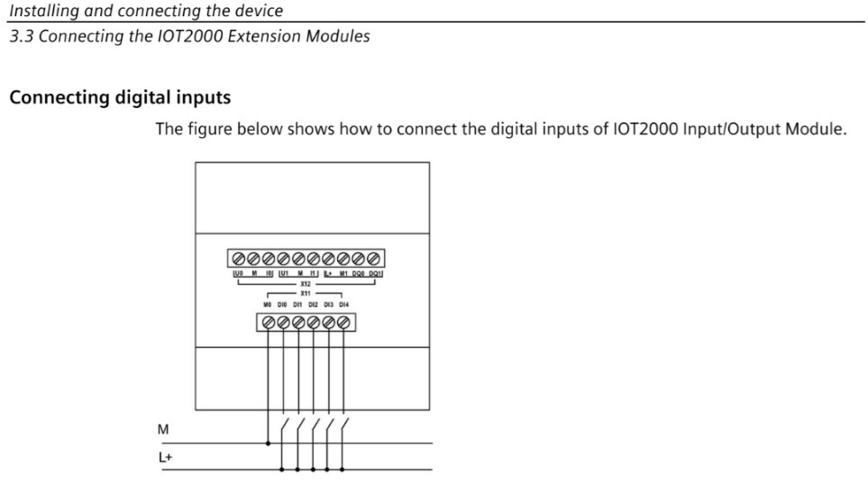

# Pràctica 2: Lectura d'entrades digitals DI amb el Siemens IOT2050

**Mòdul:** SIMATIC IOT2050 Basic PG2 + Shield IO 6ES7647-0KA01-0AA2
**Durada:** 2 hores
**Objectiu:** Aprendre a identificar, cablejar i llegir les entrades digitals DI del shield IO.

---

## 📖 Manual oficial Siemens

Descarrega el manual complet aquí:
- **Siemens Support:** https://support.industry.siemens.com/cs/document/109745681/iot2000-extension-modules-operating-instructions
- **Document:** `A5E39456816-AB_Operating_Instructions_IOT2000_Extension_Modules_1910.pdf`

---

## 📦 Models del shield

| Model | Descripció |
|-------|-----------|
| **6ES7647-0KA01-0AA2** ⬅️ El nostre | **Input/Output Module** — **5x DI**, 2x AI, 2x DQ |
| 6ES7647-0KA02-0AA2 | Input Module Sink/Source — 8x DI (només entrades) |

> El **0KA01** és el model complet amb **entrades i sortides**.

---

## 🎯 Objectius de la pràctica

- Identificar els connectors i bornes de les entrades digitals DI
- Cablejar un polsador / interruptor a una DI
- Accedir al IoT2050 via SSH (PuTTY)
- Descobrir els GPIOs de les entrades amb `gpioinfo`
- Comprendre que les DI ja estan en mode **input** per defecte (sense configurar PCAL9535)
- Llegir l'estat de les DI des de terminal amb `cat`
- Visualitzar l'estat de les DI al dashboard de Node-RED

---

# 🔧 PART 1 — HARDWARE

## 🔍 1.1 Estructura física del mòdul

**Secció 1.2.1 del manual (Pàg. 7):**


*Pàg 7 del manual: estructura del mòdul amb descripció de cada connector*

### Llegenda del mòdul 6ES7647-0KA01-0AA2 (entrades):

| Núm. | Connector | Descripció |
|------|-----------|------------|
| ③ | **Digital input interface** | Entrades digitals → **X11-2 a X11-6 (DI0-DI4)** |
| | **M (M0)** | Massa de les entrades digitals → X11-1 |
| ④ | **X1** | Connector de bornes principal (13 pins) |
| ⑥ | **X3** | Connector Arduino (acoblament al IoT2050) |

> En aquesta pràctica ens centrem només en el connector **X11 (inferior)**.

---

## 🔌 1.2 Pinout del connector X11 (entrades digitals)

| Connector | Borne | Senyal | Funció |
|-----------|-------|--------|--------|
| **X11** (inferior) | **1** | **M0** | **Massa (GND) de les entrades digitals** |
| | **2** | **DI0** | **Entrada digital 0** |
| | **3** | **DI1** | **Entrada digital 1** |
| | **4** | **DI2** | **Entrada digital 2** |
| | **5** | **DI3** | **Entrada digital 3** |
| | **6** | **DI4** | **Entrada digital 4** |

> ⚠️ El connector X11 és a la **part inferior** del shield. Els bornes estan numerats de l'1 al 6. M0 (borne 1) és la massa comuna per a totes les entrades.

## ⚡ 1.3 Cablejat d'una entrada digital

### 1.3.1 Connexió de les entrades digitals DI



Per llegir les entrades digitals, necessitem una **font d'alimentació externa de 24V DC** independent del shield. Les connexions són:

1. **+24V extern** → Polsador NA → **DI0** (X11-2)
2. **GND extern** → **M0** (X11-1, GND)

**Funcionament:**
- **Polsador NO polsat** → DI0 oberta → DI0 = **0** (repòs)
- **Polsador SÍ polsat** → +24V a DI0 → DI0 = **1** (actiu)

### 1.3.2 Exemple pràctic amb polsador

**Connexions:**
- **+24V extern** → Polsador NA → **DI0** (X11-2)
- **GND extern** → **M0** (X11-1, GND)

**Lògica:**
- **Sense polsar** → DI0 = **0** (repòs)
- **Polsant** → +24V a DI0 → DI0 = **1** (actiu)

> ⚠️ Per usar més d'una DI: cada polsador entre +24V i la DI corresponent, i totes les DI amb M0 comú a GND.

---

# 💻 PART 2 — SOFTWARE

## 🔌 2.1 Accés al IoT2050 via PuTTY

1. Obre **PuTTY**
2. Configura:
   - **Host Name:** `192.168.200.1`
   - **Port:** `22`
   - **Connection type:** `SSH`
3. Fes clic a **Open**
4. Usuari: `root`
5. Contrasenya: `123456`

> ✅ Ja ets dins del IoT2050!

---

## 🔍 2.2 Descobrir els GPIOs de les entrades DI

Les entrades digitals DI0-DI4 estan connectades als GPIOs del processador del IoT2050.

### Pas 1: Identificar els gpiochips

```bash
gpiodetect
```

Els xips que ens interessen per a les entrades:

| Chip | GPIOs | Dispositiu | Funció |
|------|-------|-----------|--------|
| **gpiochip3** | **408-463** | **42110000.gpio** | **GPIOs del processador (DI0-DI3)** |
| **gpiochip4** | **312-407** | **600000.gpio** | **GPIOs del processador (DI4)** |

### Pas 2: Llistar les línies de cada chip

```bash
gpioinfo gpiochip3
gpioinfo gpiochip4
```

A **gpiochip3** (base 408, 56 línies):

```
line 29: "IO0" → gpio408+29 = gpio437 → DI0 (X11-2) ✅
line 30: "IO1" → gpio408+30 = gpio438 → DI1 (X11-3) ✅
line 31: "IO2" → gpio408+31 = gpio439 → DI2 (X11-4) ✅
line 33: "IO3" → gpio408+33 = gpio441 → DI3 (X11-5) ✅
```

A **gpiochip4** (base 312, 96 línies):

```
line 33: "IO4" → gpio312+33 = gpio345 → DI4 (X11-6) ✅
```

### Pas 3: Fórmula per calcular el número de GPIO

```
Número GPIO = BASE_DEL_CHIP + NÚMERO_DE_LÍNIA

Exemple per DI0: gpiochip3 (base 408) + line 29 (IO0) = gpio437
Exemple per DI4: gpiochip4 (base 312) + line 33 (IO4) = gpio345
```

---

### ⚠️ 2.2.1 Arquitectura del shield: PCAL9535 (sense canvis necessaris)

El shield 6ES7647-0KA01-0AA2 utilitza **tres PCAL9535** (GPIO expanders per I2C). Recordem de la Pràctica 1:

| I2C Addr | gpiochip | Funció |
|----------|----------|--------|
| **0x21** | **gpiochip1 (GPIOs 480-495)** | **Direction control per IO0-IO13** |

**Per què les DI funcionen sense configurar res?**

Perquè **gpiochip1** inicialitza TOTES les direccions a **input (0)** per defecte. Com que les DI ja han de ser entrades, el seu pin de direcció ja està bé:

| Senyal | IO | GPIO direction | Valor per defecte |
|--------|-----|---------------|-------------------|
| **DI0** | IO0 | **gpio480** (IO0-direction) | **0 = input** ✅ |
| **DI1** | IO1 | **gpio481** (IO1-direction) | **0 = input** ✅ |
| **DI2** | IO2 | **gpio482** (IO2-direction) | **0 = input** ✅ |
| **DI3** | IO3 | **gpio483** (IO3-direction) | **0 = input** ✅ |
| **DI4** | IO4 | **gpio484** (IO4-direction) | **0 = input** ✅ |

> 💡 **Diferència clau amb la Pràctica 1:** A les DQ vam haver de canviar la direcció a **output (1)** al PCAL9535. A les DI, com que ja són **input (0)**, **no cal fer res** al PCAL9535. Només exportar i llegir.

També hi ha un segon PCAL9535 que controla les resistències **pull-up/pull-down** de les entrades:

| I2C Addr | gpiochip | Funció |
|----------|----------|--------|
| 0x25 | gpiochip2 (GPIOs 464-479) | Pull-up/down resistors |

Per defecte, les DI tenen pull-ups desactivats. Si en deixar el polsador sense polsar el valor és inestable, es pot habilitar el pull-up intern des de `gpiochip2`.

---

## ⚙️ 2.3 Configurar i llegir les entrades DI

A diferència de la Pràctica 1 (on configuràvem les DQ com a sortides), aquí **només necessitem exportar els GPIOs i llegir-los**. El PCAL9535 ja els té com a entrades per defecte.

### 2.3.1 Exportar els GPIOs de les entrades DI

```bash
# Exportar GPIOs de les entrades digitals
echo 437 > /sys/class/gpio/export   # DI0
echo 438 > /sys/class/gpio/export   # DI1
echo 439 > /sys/class/gpio/export   # DI2
echo 441 > /sys/class/gpio/export   # DI3
echo 345 > /sys/class/gpio/export   # DI4
```

> Si dona l'error "Device or resource busy", vol dir que ja estan exportats — no passa res.

### 2.3.2 Llegir el valor d'una entrada

```bash
cat /sys/class/gpio/gpio437/value   # DI0: 0 o 1
```

Prova de prémer el polsador mentre llegeixes:

```bash
# Solta el polsador i llegeix:
cat /sys/class/gpio/gpio437/value   # DI0 → ha de donar 0 ✅

# Mantén premut el polsador i llegeix:
cat /sys/class/gpio/gpio437/value   # DI0 → ha de donar 1 (+24V) ✅
```

### 2.3.3 Llegir totes les entrades alhora

```bash
echo "DI0: $(cat /sys/class/gpio/gpio437/value) | DI1: $(cat /sys/class/gpio/gpio438/value) | DI2: $(cat /sys/class/gpio/gpio439/value) | DI3: $(cat /sys/class/gpio/gpio441/value) | DI4: $(cat /sys/class/gpio/gpio345/value)"
```

### 2.3.4 Llegir en bucle (temps real)

```bash
while true; do clear; echo "=== ENTRADES DIGITALS ==="; echo "DI0: $(cat /sys/class/gpio/gpio437/value)"; echo "DI1: $(cat /sys/class/gpio/gpio438/value)"; echo "DI2: $(cat /sys/class/gpio/gpio439/value)"; echo "DI3: $(cat /sys/class/gpio/gpio441/value)"; echo "DI4: $(cat /sys/class/gpio/gpio345/value)"; sleep 0.5; done
```

Per sortir del bucle prem `Ctrl + C`.

### 2.3.5 Sobre l'arrencada automàtica

> 📌 **Per a la pràctica:** feu els passos 2.3.1 a 2.3.4 cada cop que comenceu. Així aprenem tot el procés!
>
> 🔧 **Si voleu desar la configuració permanentment** per evitar repetir l'exportació, vegeu l'**Apèndix A** al final del document.

### 2.3.6 Confirmació experimental

Un cop els GPIOs estiguin exportats, proveu les entrades:

```bash
# Amb el polsador entre +24V extern i DI0 (X11-2), i M0 (X11-1) a GND:

# Sense prémer:
cat /sys/class/gpio/gpio437/value   # → 0 ✅

# Prement:
cat /sys/class/gpio/gpio437/value   # → 1 ✅
```

Podeu repetir la prova connectant el polsador a altres DI (DI1-DI4).

---

## 🎛️ 2.4 Node-RED: Dashboard amb indicadors de DI

### 2.4.1 Importar el flow

1. Obre **http://192.168.200.1:1880/** al navegador
2. Menú ☰ → **Import** → **Clipboard**
3. Obre el fitxer `nodered-flow/flow-di.json` i enganxa'l
4. Fes clic a **Deploy** (botó taronja a dalt a la dreta)

### 2.4.2 Estructura del flow

```
                ┌───────────────────────┐
                │   Timer (cada 1s)      │
                └─────────┬─────────────┘
                          │
          ┌───────────────┼───────────────┐
          │               │               │
    ┌─────▼────┐    ┌────▼───┐      ┌───▼────┐
    │ cat DI0  │    │cat DI1 │ ...  │cat DI4 │
    │gpio437   │    │gpio438 │      │gpio345 │
    └─────┬────┘    └────┬───┘      └───┬────┘
          │              │              │
    ┌─────▼────┐    ┌────▼───┐      ┌───▼────┐
    │Estat DI0 │    │Estat   │      │Estat   │
    │  (text)  │    │DI1     │      │DI4     │
    └──────────┘    └────────┘      └────────┘
```

### 2.4.3 Accedir al Dashboard

Obre al navegador:

> **http://192.168.200.1:1880/ui/**

Veureu l'estat de cada entrada digital:

```
┌──────────────────────────────────────────┐
│  🎛️ CONTROL IoT2050                      │
├──────────────────────────────────────────┤
│  ENTRADES DIGITALS                       │
│                                          │
│  DI0 (X11-2) — gpio437:   1              │
│  DI1 (X11-3) — gpio438:   1              │
│  DI2 (X11-4) — gpio439:   1              │
│  DI3 (X11-5) — gpio441:   1              │
│  DI4 (X11-6) — gpio345:   1              │
└──────────────────────────────────────────┘
```

Cada DI mostra **1** (no polsat / HIGH) o **0** (polsat / LOW) en temps real, actualitzant-se cada segon.

---

## 🧪 Prova ràpida completa

### Des de SSH (PuTTY):

```bash
# 1. Exportar GPIOs
echo 437 > /sys/class/gpio/export   # DI0
echo 345 > /sys/class/gpio/export   # DI4

# 2. Llegir (sense connectar res encara)
cat /sys/class/gpio/gpio437/value   # → pot donar 0 o 1 (flotant)

# 3. Connecta:
#    - Polsador NA entre Font 24V externa (+) i DI0 (X11-2)
#    - M0 (X11-1) a Font 24V externa (-)

# 4. Llegir sense prémer
cat /sys/class/gpio/gpio437/value   # → 0 ✅

# 5. Llegir premint (mantén el polsador apretat)
cat /sys/class/gpio/gpio437/value   # → 1 (+24V) ✅ ✨
```

### Des del Node-RED:

1. Obre **http://192.168.200.1:1880/ui/**
2. Prem el polsador i observa com canvia l'indicador al dashboard

> ⚠️ **Si no funciona:** Comprova que has exportat el GPIO (`echo 437 > /sys/class/gpio/export`), que el polsador està entre Font 24V externa (+) i DI (X11-2..6), que M0 (X11-1) està a GND de la font externa, i que el cablejat arriba als bornes correctes.

---

## 📋 Resum de la pràctica

| Pas | Què fem | Comandes clau |
|-----|---------|---------------|
| 1 | Cablejar | Polsador NA DI→+24V extern. M0 (GND) → GND font |
| 2 | Accedir | PuTTY → 192.168.200.1 → root / 123456 |
| 3 | Descobrir | `gpiodetect`, `gpioinfo gpiochip3/4` |
| 4 | Exportar | `echo 437 > /sys/class/gpio/export` (i 438, 439, 441, 345) |
| 5 | Llegir | `cat /sys/class/gpio/gpio437/value` → 0 o 1 |
| 6 | Node-RED | http://192.168.200.1:1880/ui/ |

### Diferència clau amb la Pràctica 1 (DQ)

| Aspecte | DQ (Pràctica 1) | DI (Pràctica 2) |
|---------|-----------------|-----------------|
| Direcció | **Output** | **Input** |
| PCAL9535 | **S'ha de configurar** (1 = output) | **Ja està a input (0)** per defecte |
| Acció | Escriure (`echo 1 > value`) | Llegir (`cat value`) |
| Node-RED | Botons ON/OFF | Indicadors d'estat |

---

## 📁 Contingut de la pràctica

```
practica-2/
├── README.ca.md                    ← Aquesta guia (català)
├── README.es.md                    ← Guía en castellano
├── nodered-flow/
│   └── flow-di.json                ← Flow de Node-RED (lectura DI)
└── images/
    └── wiring-di-pullup.png        ← Esquema de cablejat DI
```

> Les imatges del manual (estructura, pinout, cablejat) són les mateixes que a la Pràctica 1 i estan a `practica-1/images/`.

---

## 📌 Apèndix A: Configuració permanent (rc.local)

Si voleu que els GPIOs de les DI s'exportin **automàticament en cada arrencada**:

```bash
nano /etc/rc.local
```

Afegiu **abans del `exit 0`**:

```bash
# Exportar GPIOs de les entrades digitals
echo 437 > /sys/class/gpio/export 2>/dev/null   # DI0
echo 438 > /sys/class/gpio/export 2>/dev/null   # DI1
echo 439 > /sys/class/gpio/export 2>/dev/null   # DI2
echo 441 > /sys/class/gpio/export 2>/dev/null   # DI3
echo 345 > /sys/class/gpio/export 2>/dev/null   # DI4

exit 0
```

```bash
chmod +x /etc/rc.local
systemctl enable rc-local
```

---

## 📌 Apèndix B: Reset per a la pràctica

```bash
# Opció 1 (recomanada)
reboot

# Opció 2 (sense reiniciar)
echo 437 > /sys/class/gpio/unexport 2>/dev/null
echo 438 > /sys/class/gpio/unexport 2>/dev/null
echo 439 > /sys/class/gpio/unexport 2>/dev/null
echo 441 > /sys/class/gpio/unexport 2>/dev/null
echo 345 > /sys/class/gpio/unexport 2>/dev/null
```

---

## 📄 Llicència

MIT — Ús educatiu lliure

---

*Pràctica 2 — Mòdul IOT2050 Siemens*
